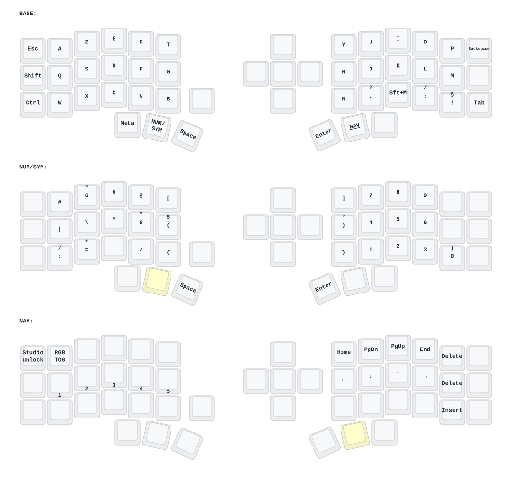

# Corne-J — French AZERTY layout

The host must use **French AZERTY** (on the ThinkPad: XKB `fr(azerty)`).
Character bindings in `config/eyelash_corne.keymap` use `FR_*` names;
`config/keys_fr.h` translates them to ZMK's US HID keycodes.
This header is local and requires no extra West module or package.
Keymap Drawer is run with `uvx --from keymap-drawer keymap` (cached tool,
no system package installation).

Examples: `&kp FR_A` types `a`, `&kp FR_U_GRAVE` types `ù`,
`&kp FR_N1` types `1`, and `&kp FR_LEFT_BRACE` types `{`.
`FR_N0` through `FR_N9` include Shift; `FR_CARET` produces a direct `^`
on Linux `fr(azerty)`, while `FR_DEAD_CIRCUMFLEX` is the dead key for accents.
The header also provides aliases for `é`, `è`, `à`, `ç`, and other symbols
for future changes; they are not added to the current layout.

## Current layers

The five optional central switch positions remain disabled.

```text
BASE
Esc    A Z E R T           Y U I O P Backspace
Shift  Q S D F G           H J K L M ù
Ctrl   W X C V B  Space    N , ; : ! Tab
          Meta NAV Space  Enter NUM/SYM AltGr

NUM/SYM (right thumb, hold)
       # { [ ( )           7 8 9
       | \ ^ @ =           4 5 6
       ] } . / §           1 2 3 0

NAV (left thumb, hold)
Studio unlock             Home PgDn PgUp End Delete
                          Left Down Up Right Delete
                          Home PgDn PgUp End Insert
```

Navigation and modifiers keep their ordinary ZMK names. Only printable
characters use `FR_*`. The alias conversion preserves the V1 keycodes,
including the `§` binding; it does not change the physical layout.

## Studio and diagrams

ZMK Studio's host locale selection is still planned. These aliases improve
the source file but do not change Studio's US key labels. Studio edits are
stored on the keyboard and do not update this repository. After editing and
flashing this source, a Studio-managed keyboard needs **Restore Stock
Settings** to use the compiled layout; this replaces saved Studio edits.

`keymap_drawer.config.yaml` includes French legends for the aliases in use.
The checked-in YAML and SVG below were regenerated locally with Keymap
Drawer 0.23.0 and checked visually. The Draw Keymap workflow updates them
after publication.

## Local workflow and rollback

Working copy: `~/Code/corne-j-keyboard-zmk`, branch `keymap-v1`.
This path is outside the ThinkPad's Syncthing folders (`~/Documents` and
`~/Shared`); Git handles the firmware repository.

Review with `git diff` and `git diff --check`. Commit and push only when
ready, then check the firmware build and test the resulting UF2 on hardware.
The local alias conversion was checked by preprocessing both versions with
ZMK v0.3.0 headers: all three layers have exactly the same expanded bindings.
This is a static check, not a firmware build or hardware test.

To undo this conversion **before any subsequent edits**, restore the five
tracked files with `git restore -- config/eyelash_corne.keymap
keymap_drawer.config.yaml README.md keymap-drawer/eyelash_corne.yaml
keymap-drawer/eyelash_corne.svg` (as one command), then move the untracked
`config/keys_fr.h` outside the repository. Preserve any later work first.
Because the HID bindings are unchanged, this conversion alone does not
require flashing the keyboard.

References: [ZMK Studio](https://zmk.dev/docs/features/studio),
[ZMK Locales](https://github.com/joelspadin/zmk-locales).


